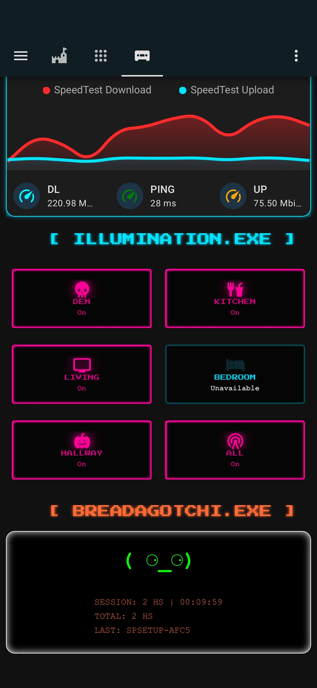
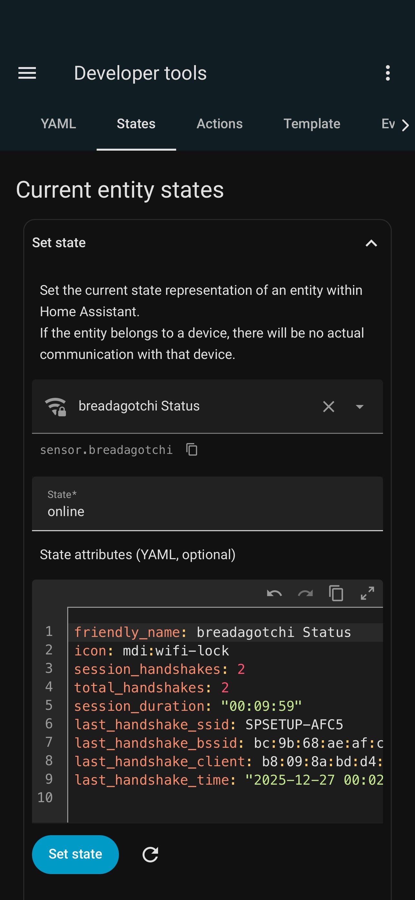
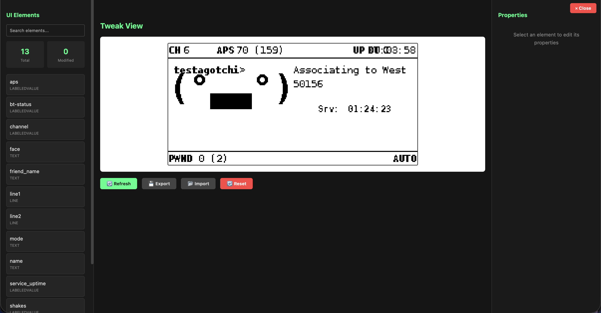
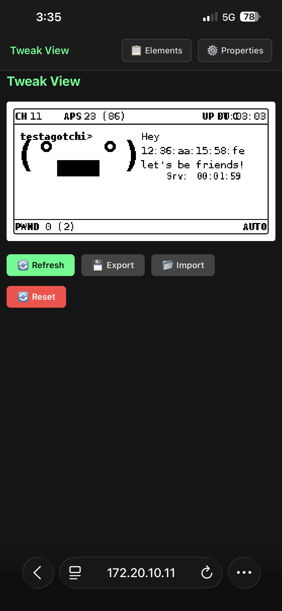

# Pwnagotchi Plugins

## Table of Contents

- [Plugin Overview](#plugin-overview)
  - [pwnios.py](#pwnios)
  - [hapwn.py](#hapwn)
  - [tweak_view2.py](#tweak_view2)
- [Compatibility](#compatibility)
- [License](#license)
- [Credits & Inspiration](#credits)
- [Disclaimer](#disclaimer)

<a id="plugin-overview"></a>
## Plugin Overview

<a id="pwnios"></a>
## **pwnios**

### [PwnIOS Detailed Readme](https://github.com/BraedenP232/PwnIOS)

### iOS Companion App Integration

`pwnios` enables real-time communication between your Pwnagotchi and the **[Pwnagotchi Companion iOS app](https://apps.apple.com/ca/app/pwnagotchi-companion/id6751243451)**.

It acts as the on-device bridge for live status updates, remote actions, and session awareness using a resilient WebSocket connection.

### Key Features

* Real-time device status streaming
* Intelligent WebSocket reconnection
* Message queuing during connection loss
* Health monitoring & keepalive system
* Optimized for iPhone & iPad clients

## Configuration Options

| Option               | Description                  | Default                   |
| -------------------- | ---------------------------- | ------------------------- |
| `enabled`            | Enable the plugin            | `true`                    |
| `port`               | PwnIOS WS Port               | `8082`                    |
| `display`            | Display label on Pwn         | `false`                   |
| `display_gps`        | Display GPS label on Pwn     | `false`                   |
| `pisugar`            | Enable PiSugar monitoring    | `false`                   |
| `save_gps_log`       | Enable GPS logging           | `false`                   |
| `gps_log_path`       | Where to save gps log        | `/tmp/pwnagotchi_gps.log` |

### 📸 Screenshots

<p align="center">
  
  
</p>

<p align="center">
  <sub>Live device status and health monitoring</sub>
  &nbsp;&nbsp;&nbsp;&nbsp;
  <sub>Real-time session and activity updates</sub>
</p>

### Intended Use

* Pair with the **[Pwnagotchi Companion iOS app](https://apps.apple.com/ca/app/pwnagotchi-companion/id6751243451)**
* Live dashboards
* Remote awareness without SSH
* Future-proofed for control extensions

> This plugin does **not** expose a public web UI — it is designed exclusively for the companion app.

<a id="hapwn"></a>
## **hapwn**

### [HAPwn Detailed Readme](https://github.com/BraedenP232/HAPwn)

### Home Assistant Integration Plugin

`hapwn` connects your Pwnagotchi directly to **Home Assistant** using its REST API, enabling automation-ready telemetry and event tracking.

It’s built for users who want their Pwnagotchi to behave like a *first-class smart device*.

### What It Sends to Home Assistant

* Online / Offline state
* Session statistics
* Handshake discovery events
* Runtime & activity data

## Configuration Options

| Option               | Description                  | Default      |
| -------------------- | ---------------------------- | ------------ |
| `ha_url`             | Home Assistant external URL  | **Required** |
| `ha_token`           | Long-lived access token      | **Required** |
| `unit_name`          | Sensor/entity name           | `pwnagotchi` |
| `heartbeat_interval` | Heartbeat interval (seconds) | `60`         |

### 📸 Screenshots

<p align="center">
  
  
</p>

<p align="center">
  <sub>Home Assistant dashboard view</sub>
  &nbsp;&nbsp;&nbsp;&nbsp;
  <sub>Entities and sensor data exposed by hapwn</sub>
</p>

### Why Use hapwn?

* Home Assistant dashboards
* Automation triggers
* Notifications (mobile, Discord, etc.)
* Historical tracking
* Presence-style awareness

### Typical Automations

* Notify when Pwnagotchi goes offline
* Log handshake counts per session
* Track uptime visually
* Trigger scripts when new handshakes are captured

<a id="tweak_view2"></a>
## **tweak_view2**

### [Sniffleupagus' tweak_view](https://github.com/Sniffleupagus/pwnagotchi_plugins/blob/main/tweak_view.py)

### Modernized UI Layout Editor

`tweak_view2` is a **refined and updated version** of the original `tweak_view` plugin by *Sniffleupagus*.

> Still powerful. Still dangerous. But much nicer to live with.

### What’s Improved

* Clean, more readable layout
* Mobile-responsive UI behavior
* Real-time UI updates
* Improved spacing and alignment

### Original Plugin Info

```text
Author: Sniffleupagus
Version: 1.1.1
License: GPL3
Description: Edit the UI layout. Ugly interface, no guardrails. Be careful!!!
```

### 📸 Screenshots

<p align="center">
  
  
</p>

<p align="center">
  <sub>Cleaner, more readable desktop layout</sub>
  &nbsp;&nbsp;&nbsp;&nbsp;
  <sub>Improved mobile-responsive UI behavior</sub>
</p>

### What Changed

* Visual polish
* Live update handling
* Improved responsiveness on small screens
* Safer defaults (still no guardrails!!!)

<a id="compatibility"></a>
## Compatibility

* Pwnagotchi (latest Jayofelony image)
* Home Assistant (REST API)
* iOS (Pwnagotchi Companion app)

<a id="license"></a>
## License

All plugins are released under **GPLv3**, unless otherwise stated in the source file.

Original authorship is preserved where applicable.

<a id="credits"></a>
## Credits & Inspiration

* [NeonLightning](https://github.com/NeonLightning) — for README structure inspiration and plugins
* [Sniffleupagus](https://github.com/Sniffleupagus) — original `tweak_view`
* [Jayofelony](https://github.com/jayofelony) — ongoing Pwnagotchi ecosystem work
* [WPA-2](https://github.com/wpa-2) - for the best support, ongoing work, and discord moderation
* Home Assistant community

<a id="disclaimer"></a>
## Disclaimer

These plugins interact deeply with system state, UI rendering, and external services.

**You are responsible for what you enable.**
Test carefully. Backup often. Hack responsibly.
